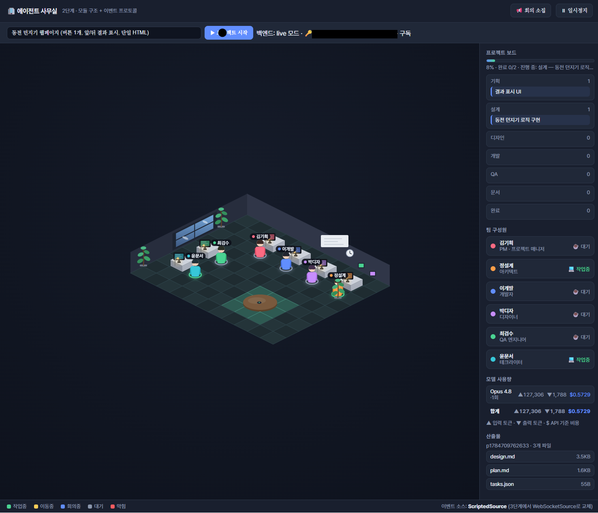

# 🏢 에이전트 사무실 (Agent Office)

여러 Claude 에이전트에게 **직함과 역할**을 부여하고, 한 프로젝트를 **협업으로 완성**시키되
그 과정을 아이소메트릭 사무실에서 **캐릭터가 움직이는 모습**으로 실시간 시각화하는 웹 앱.

`의존성 0 · Canvas`　`SSE + Agent SDK`　`에이전트 6명`　`MIT`

> 설계 전문은 [`에이전트 사무실 설계도.md`](./에이전트%20사무실%20설계도.md) 참고.



---

## 주요 특징

- **프런트엔드** — 의존성 0, 아이소메트릭 2.5D 캔버스(외부 에셋 없이 코드로 그린 도형).
- **백엔드** — 실제 Claude 에이전트 6명(PM·아키텍트·개발자·디자이너·QA·테크라이터)이 작업하며 의미 이벤트를 SSE로 방출.
- **승인 게이트** — PM이 실행 플랜을 올리면 사용자가 결재(승인/반려)한 뒤에만 다음 단계로 진행.
- **이벤트 소스 분리** — 소스만 바꾸면 시각화는 그대로. 스크립트(오프라인) ↔ 실제 에이전트 전환.

---

## 빠른 시작 — 오프라인 (무료 · 로그인 불필요)

로그인 없이 **스크립트 모드**로 바로 볼 수 있습니다.

```bash
node web/serve.mjs        # http://localhost:5173
```

브라우저에서 http://localhost:5173 열기 → 캐릭터가 스크립트 이벤트로 움직입니다.

---

## 실제 Claude 에이전트로 실행

실제 에이전트가 코드·문서를 만들며 사무실이 움직이게 하려면 **본인 Claude 계정**이 필요합니다.

### ⚡ 빠른 실행 — 이미 Claude Code 사용 중이라면

```bash
cd server && npm install                 # 최초 1회
OFFICE_LIVE=1 node server/src/index.mjs  # 터미널 1 · :8787
node web/serve.mjs                       # 터미널 2 · :5173
```

→ 브라우저 **http://localhost:5173/?live** 에서 주제 입력 → **▶ 프로젝트 시작**

백엔드가 로그인된 구독을 자동 감지합니다. 로그인이 안 돼 있으면 `claude` 한 번만 실행하세요.

<details>
<summary><b>Claude Code가 처음이신가요? — 사전 준비와 로그인 방법</b></summary>

#### 사전 준비

- **Node.js 18+**
- 아래 인증 중 **하나**:
  - **Claude 구독** (Pro / Max / Team / Enterprise) — 추천
  - 또는 **Anthropic API 키** (종량제, https://platform.claude.com )

#### 로그인 (셋 중 하나)

**A. 구독 로그인 (권장)**
```bash
claude          # 브라우저가 열리며 본인 Claude 구독으로 로그인
```
자격증명이 `~/.claude/.credentials.json` 에 저장됩니다. (Claude Code 미설치 시: `npm i -g @anthropic-ai/claude-code`)

**B. 헤드리스/서버 (브라우저 없이)**
```bash
claude setup-token                       # 1년짜리 OAuth 토큰 발급(구독 필요)
export CLAUDE_CODE_OAUTH_TOKEN=<발급된 토큰>
```

**C. API 키 (종량제)**
```bash
export ANTHROPIC_API_KEY=sk-ant-...       # Console에서 발급
```

> ⚠️ 구독을 쓰려면 `ANTHROPIC_API_KEY` 를 **설정하지 마세요** — API 키가 우선순위가 높아 구독보다 먼저 사용됩니다.
> Agent SDK는 필요한 바이너리를 **번들**하므로, 실행에 별도 CLI 설치는 필요 없습니다(로그인 단계에만 `claude` 사용).

</details>

### 실행 후 흐름

킥오프 후 PM이 실행 플랜을 올리면 **결재 모달**이 뜹니다 — 최고 승인자(당신)가 **승인**해야 다음 단계로 진행하고,
**반려**(사유 입력) 시 PM이 피드백을 반영해 재상신합니다.

`http://localhost:8787/health` 에서 현재 모드(mock/live)·인증·로그인 계정을 확인할 수 있습니다.

---

## 바탕화면 단축키 만들기 — 원클릭 실행 (Windows + WSL)

`scripts/office-start.sh` 는 백엔드와 프런트를 함께 띄우고 브라우저를 자동으로 엽니다. 이미 떠 있는 서버는
재사용하고, 창을 닫으면 여기서 띄운 서버는 함께 종료됩니다. 바탕화면에서 더블클릭으로 실행하려면:

1. **배치 파일 만들기** — 바탕화면 우클릭 → *새로 만들기 → 텍스트 문서*. 아래 내용을 붙여넣고
   파일명을 `에이전트 사무실.bat` 으로 저장합니다(확장자가 `.txt` 가 되지 않도록 주의).
   ```bat
   @echo off
   title Agent Office
   wsl.exe -- bash -lc "/mnt/f/agent-office/scripts/office-start.sh"
   ```
   경로 `/mnt/f/...` 는 **본인 클론 위치**로 수정하세요.

2. **(선택) 아이콘 입히기** — `.bat` 은 아이콘 지정이 안 되므로, 바로가기(`.lnk`)를 만들면 앱 아이콘을 붙일 수 있습니다.
   - `.bat` 우클릭 → *바로가기 만들기*
   - 바로가기 우클릭 → *속성 → 아이콘 변경* → 저장소의 `docs/office.ico` 선택
     (Windows 경로 예: `F:\agent-office\docs\office.ico` 또는 `\\wsl$\Ubuntu\...`)
   - 바로가기를 바탕화면에 두기

3. **더블클릭 실행** — 터미널 창이 뜨며 서버가 실행되고, 잠시 뒤 기본 브라우저가
   `http://localhost:5173/?live` 를 자동으로 엽니다. 창을 닫으면 서버가 종료됩니다.

**이 PC 전용 설정 (계정 프로필 등)** — 같은 폴더에 `scripts/office-start.local.sh` 를 만들어 두면 스크립트가 시작 시
자동으로 불러옵니다(이 파일은 커밋되지 않음). 특정 Claude 계정 프로필로 실행하려면:
```bash
# scripts/office-start.local.sh
export CLAUDE_CONFIG_DIR="$HOME/.claude-b"   # 이 프로필에 로그인된 계정으로 에이전트 실행
```

> **문제 해결 · `node: command not found`** — 스크립트가 nvm을 자동 로드하고, 실패하면 설치된 최신 `node` 를
> PATH에 추가하도록 되어 있어 대부분 해결됩니다. 그래도 안 되면 WSL 터미널에서 `node -v` 로 설치 여부를 확인하세요.

---

## 계정 확인 · 다른 계정으로 전환

- **지금 누구로 로그인됐는지**는 앱 상단바(`백엔드: live 모드 · 🔑 이메일 · 구독`)와 `GET /health` 의 `account` 필드에서 확인할 수 있습니다.
- **앱 안에서 계정 전환은 불가**합니다 — 구독 로그인은 Claude Code가 진행하는 브라우저 OAuth라 앱이 대신할 수 없습니다. 전환은 터미널에서 합니다.

<details>
<summary><b>다른 계정으로 바꾸기 (기본)</b></summary>

로그인 정보는 프로젝트가 아니라 PC의 `~/.claude` 에 저장됩니다.
```bash
claude /logout    # 현재 계정 로그아웃
claude            # 다시 실행 → 브라우저에서 다른 계정으로 로그인
```
자격증명은 쿼리 시점마다 읽으므로 **백엔드 재시작 없이** 다음 프로젝트부터 새 계정이 적용됩니다(상단바 라벨은 페이지 새로고침 시 갱신).

</details>

### 여러 계정을 번갈아 쓰기 (프로필 분리)

계정별로 로그인 폴더를 나눠두고, 서버 시작 시 `CLAUDE_CONFIG_DIR` 로 선택합니다.
```bash
# 계정 B를 별도 프로필 폴더에 한 번만 로그인
CLAUDE_CONFIG_DIR=~/.claude-b claude

# 이후 서버 시작 시 환경 변수로 계정 선택
OFFICE_LIVE=1 node server/src/index.mjs                                  # 기본(~/.claude) 계정
CLAUDE_CONFIG_DIR=~/.claude-b OFFICE_LIVE=1 node server/src/index.mjs    # 계정 B
```

> 원클릭 스크립트(`scripts/office-start.sh`)는 `scripts/office-start.local.sh` 에서 `CLAUDE_CONFIG_DIR` 을 지정하면
> 그대로 사용하므로, 프로필 분리와 함께 쓸 수 있습니다.

---

## 환경 변수

| 변수 | 설명 | 기본값 |
|---|---|---|
| `OFFICE_LIVE` | `1`이면 실제 에이전트 실행, 미설정이면 mock(무료) | 미설정 |
| `OFFICE_MODEL` | 설정 시 **전원** 이 모델로 오버라이드(테스트용). 미설정 시 역할별 기본 사용 | 역할별(아래) |
| `OFFICE_WORKSPACE` | 산출물 저장 폴더 지정(아래 '산출물 폴더' 참고) | `server/workspace/` |
| `CLAUDE_CODE_OAUTH_TOKEN` | 헤드리스 로그인 토큰 | — |
| `ANTHROPIC_API_KEY` | API 키 모드(설정 시 구독보다 우선) | — |
| `CLAUDE_CONFIG_DIR` | 특정 Claude 로그인 디렉터리 지정 | `~/.claude` |
| `PORT` | 백엔드 포트 | `8787` |

**역할별 기본 모델** (`server/src/roles.mjs`):

| 역할 | 담당 · 산출물 | 모델 |
|---|---|---|
| PM(김기획) | 요구사항 분해·총괄 (tasks.json) | `claude-opus-4-8` |
| 아키텍트(정설계) | 기술 설계 (design.md) | `claude-opus-4-8` |
| 개발자(이개발) | 구현 (코드 파일) | `claude-opus-4-8` |
| 디자이너(박디자) | UI/UX 스펙 | `claude-sonnet-5` |
| QA(최검수) | 검수·판정 (qa-\<id\>.txt) | `claude-sonnet-5` |
| 테크라이터(윤문서) | 문서 (README 등) | `claude-sonnet-5` |

파이프라인: 기획(PM) → 🔏 사용자 결재(승인/반려) → 설계 → 디자인 → 개발 → QA → 문서 → 완료 (QA 반려 시 개발로 1회 재작업)

`server/.env.example` 를 `server/.env` 로 복사해 채워도 됩니다. (`.env` 는 커밋되지 않음)

---

## 산출물 폴더 (에이전트가 만든 파일이 저장되는 곳)

에이전트들이 만드는 플랜·설계서·코드·QA 판정·문서는 프로젝트마다 격리된 폴더에 저장됩니다.

```
server/workspace/
└── p<타임스탬프>/      ← 프로젝트 1회 실행당 폴더 하나 (예: p1784706657834)
    ├── plan.md         ← PM의 결재용 플랜
    ├── tasks.json      ← 작업 분해 목록
    ├── design.md …     ← 이후 단계 산출물
    └── qa-1.txt …      ← QA 판정
```

- **기본 위치는 클론한 폴더 기준 상대 경로**(`server/workspace/`)입니다. 어느 PC에 어디로 클론하든
  별도 설정 없이 그 클론 안에 저장됩니다 (커밋되지 않음 — `.gitignore` 로 제외).
- **다른 폴더에 모으고 싶으면** `OFFICE_WORKSPACE` 로 지정하세요:
  ```bash
  OFFICE_WORKSPACE=~/agent-outputs OFFICE_LIVE=1 node server/src/index.mjs
  ```
- 어디를 지정하든 에이전트는 **그 폴더 안에서만** 파일을 쓸 수 있습니다(경로 탈출 차단).
- WSL 사용자는 `/mnt/c/...` 같은 Windows 경로보다 WSL 네이티브 경로(`~/...`)가 파일 I/O가 훨씬 빠릅니다.

---

## 구조

```
소스(ScriptedSource | SSESource) ──의미 이벤트──▶ EventQueue ──▶ Choreographer ──▶ World ──▶ Renderer/UI
web/  프런트엔드(ES 모듈)   ·   server/  백엔드(SSE + Claude Agent SDK)
```

| 경로 | 역할 |
|---|---|
| `web/` | 아이소메트릭 렌더러 · 이벤트 큐 · 연출 · 소스 추상화 ([`web/README.md`](./web/README.md)) |
| `server/src/index.mjs` | HTTP + SSE 서버 (`/events`, `/project`, `/approval`, `/health`) |
| `server/src/orchestrator.mjs` | 프로젝트 상태 머신 (기획→개발→디자인→QA→완료) |
| `server/src/agents.mjs` | Claude Agent SDK로 각 역할 실행, 도구 호출을 이벤트로 번역 |
| `server/src/workspace.mjs` | 산출물 샌드박스(경로 탈출 차단) |
| `scripts/office-start.sh` | 원클릭 실행 스크립트(백엔드+프런트+브라우저) |
| `index.html` | 1단계 단일 파일 프로토타입(참고용) |

---

## 보안

- API 키·토큰·자격증명은 **저장소에 커밋되지 않습니다** (`.gitignore` 로 `.env`, `*.credentials.json`, `node_modules/`, `server/workspace/`, `scripts/office-start.local.sh` 제외).
- 로그인 자격증명은 저장소 밖(`~/.claude`)에 저장됩니다.
- 에이전트 파일 쓰기는 `server/workspace/<projectId>/` 로 제한되고 상위 경로 탈출을 차단합니다.
- 실행은 격리 샌드박스 가정하에 도구를 자동 승인(`bypassPermissions`)합니다. 신뢰할 수 없는 환경에서 임의 코드를 실행하지 않도록 주의하세요.

## 라이선스

[MIT](./LICENSE)
